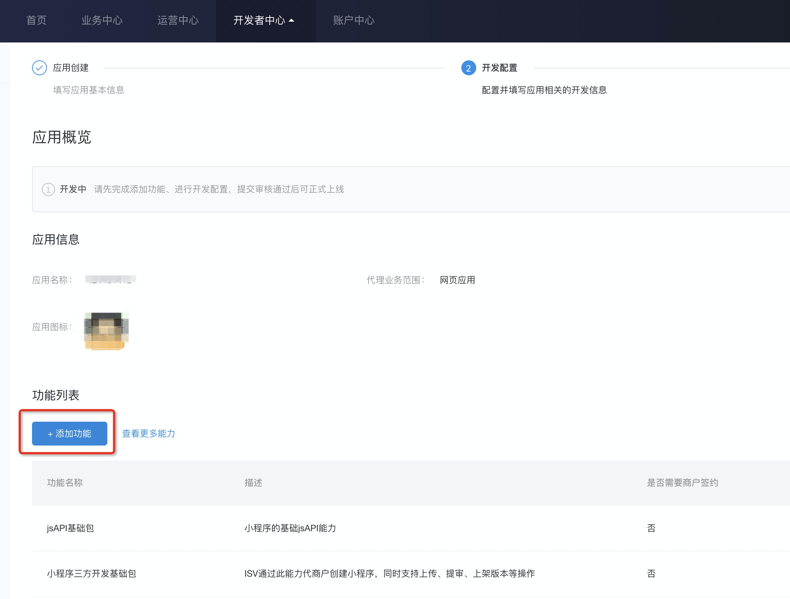
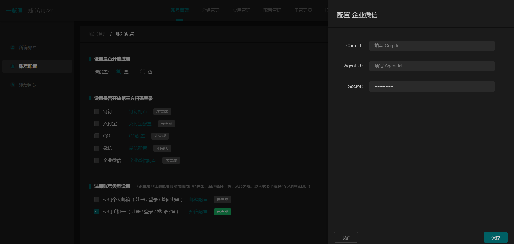
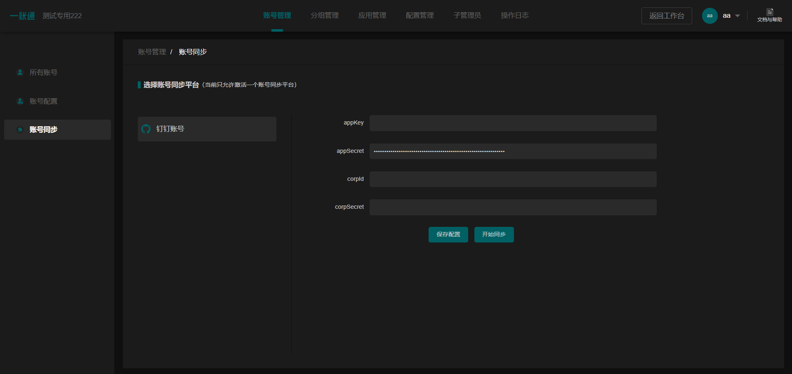

部署与配置
==========

.. MUTABLE ON REFACTOR

一账通的主体是一个提供 HTTP RESTful API 的 Django 项目，并含有一些存储组件，\
一个基于 MySQL 的 LDAP 协议适配器，一个 Nginx 反向代理以及一个可选的图形前端。\
一账通提供了一个 ``settings_local.py`` 文件对整个项目进行统一配置。\
由于项目结构相对复杂，部署与配置较为繁琐，推荐使用 Helm_ 在 Kubernetes_ 上进行部署以避免手工配置协调项目组件。\

================ ============
 部署方式          建议
---------------- --------------
Kubernetes 部署    推荐
Docker 部署        可选
手工部署            不推荐
================ ==============

Kubernetes 部署
---------------

.. seealso::
   * `Kubernetes 官方文档`_
   * `Helm 用户指南`_

环境需求
::::::::

:必需:
   * 一个正确部署了 Tiller 的 Kubernetes 集群
   * 一个可访问该集群的 Helm 客户端

:推荐:
   * 一个 `Ingress 控制器`_
   * 一个可以被解析到服务器上的独立域名
   * Kubernetes 集群中部署了 cert-manager_ 组件

如何部署
::::::::

1. 获取一账通的 Helm Chart。

    .. code-block:: shell

       git clone https://github.com/longguikeji/arkid-charts.git

       cd arkid-charts/chart

2. 使用 ``values.yaml`` 进行项目配置。

    .. code-block:: shell

       vim values.yaml

    .. seealso::
       * `如何配置`_
       * `settings_local.py 详解`_

3. 使用 Helm 将一账通部署到 Kubernetes 集群中。

    .. code-block:: shell

       helm install .

4. 等待服务启动完成之后，测试应用是否正确运行 [#f1]_。

    .. code-block:: shell

       export ARKID_PORTAL_POD=$(kubectl get pods \
       -o go-template --template '{{range .items}}{{.metadata.name}}{{"\n"}}{{end}}' \
       --selector=app.kubernetes.io/name=arkid-portal)

       kubectl port-forward $ARKID_PORTAL_POD 10080:80

       http -F GET http://127.0.0.1:10080/ping
    ..

如何配置
::::::::

在此种部署方式下，所有的配置均可通过 ``values.yaml`` 完成，而 ``settings_local.py`` 则作为 \
Kubernetes 的 ConfigMap 组件存在。因此在本小节中，除非显式说明，所有的文字均关联于对 ``values.yaml`` 的检视或修改。

.. ASYNC CROSS REFERENCE TODO:
ArkOS

:必须:
   * *必须* 配置 ``settingsLocal`` ConfigMap 项到合适的状态，详见 `settings_local.py 详解`_。
   * 如未使用 ArkOS，``apiServer`` *必须* 置空。
   * 如为初次使用，``presistence.init`` *必须* 设置为 ``true``。
   * 如果配置了 Ingress 控制器，``ingress.annotations.kubernetes.io/ingress.class`` \
     *必须* 设置为控制器的类型。
   * 如果 Ingress 控制器所在的服务器拥有域名并且域名解析正常，``ingress.host.name`` *必须* 设置为该域名。

:推荐:
   * *推荐* 在目标集群中部署 cert-manager 并开启 ``ingress.cert`` 及 ``ingress.tls``。
   * *推荐* 修改 ``presistence.mysql.rootPassword`` 及 \
     ``ldap.adminPassword`` 为合适的口令。

.. ASYNC TODO:
Disable FE

:可选:

.. TODO:
Separate OPTIONAL, SHOULD NOT & MUST NOT

部署流程解析
::::::::::::

.. TODO:
Deployment Process

Docker 部署
-----------
.. seealso::
   * `Docker Compose 官方文档`_
   * `一账通 docker-compose 配置`_

环境需求
::::::::

:必需:
   * docker
   * docker-compose

如何部署
::::::::

1. 下载一账通源码

    .. code-block:: shell

      git clone https://github.com/longguikeji/arkid-core.git
      cd arkid-core/docker-compose

2. 按提示修改 .env 文件、be/settings.py 文件

3. 使用 docker-compose 启动一账通

    .. code-block:: shell

      docker-compose up

4. 访问一账通

   打开 http://localhost:8989 (具体端口视 .env 中 HTTP_PORT 而定)，以内置账号 admin / admin 登录。

手工部署
--------

本地调试
--------

如何部署
::::::::

1. 获取一账通应用后端 `arkid-core`_ 的代码并运行。

   .. code-block:: shell

      git clone https://github.com/longguikeji/arkid-core.git

      cd arkid-core

      pip install --no-cache-dir -r requirements.txt

      python manage.py migrate

      python manage.py runserver 0.0.0.0:8000

      celery -A celery_app worker -Q default,perm -l debug

      celery -A celery_app beat -l debug

2. 获取一账通前端 `arkid-frontend`_ 的代码并运行。通过 ``FE_DEV_PROXY_ONEID`` 来指定 arkid-core 绑定的协议地址与端口号，默认为http://127.0.0.1:8000 。

   .. code-block:: shell

      git clone https://github.com/longguikeji/arkid-frontend.git

      cd arkid-frontend

      yarn install

      FE_DEV_PROXY_ONEID=http://127.0.0.1:8000 yarn serve

.. _arkid-core: https://github.com/longguikeji/arkid-core
.. _arkid-frontend: https://github.com/longguikeji/arkid-frontend

``settings_local.py`` 详解
--------------------------

.. TODO
Docker Compsoe
Manual

``settings_local.py`` 本质上是对 Django 框架默认配置文件 ``settings.py`` 的覆写，\
但一账通不推荐用户修改除开发人员暴露出来的部分之外的任何配置。该文件的配置样例详见 `settings_example.py`_，\
本节会指出其中必须更改的部分并选择性说明其中部分选项，并在最后给出 ``settings_example.py`` 的全文。

:必须:
   * 在生产环境下，*必须* 重新生成一个 ``SECRET_KEY`` 并将 ``DEBUG`` 置为  ``False``。

:推荐:
   * *推荐* 将 ``PRIVATE_IP``、``PUBLIC_IP`` 及 ``BASE_URL`` 依自身网络配置正确填写。\
     如果使用 Ingress，应填写为 Ingress 控制器的 IP 地址或域名，
     并根据是否使用 TLS 选择协议。它们是 UI 中的展示性信息，被用于向第三方应用提供接入信息（如 OAuth2.0 端点 URI）。
   * 理由同上，*推荐* 正确配置 ``LDAP_SERVER`` 及 ``LDAPS_SERVER``。

:可选:
   * 如需启用自定义头像或公司登录页等需求文件存储的服务，*可以* 自行配置或购买 MinIO 服务并填写 ``MINIO_*`` 配置。
   * 如需启用向第三方应用同步的功能，需向 ``EXECUTERS`` 中追加相应的组件，目前只支持钉钉。

:不推荐:
   * 在基于 Chart 的环境下， *不推荐* 手动修改 ``DATABASES``、``REDIS_CONFIG`` 相关配置\
     及 ``LDAP_*`` （除用于展示的URI），而应通过 ``values.yaml`` 进行配置。

.. code-block:: python

   # pylint: disable=undefined-variable, wrong-import-position, line-too-long
   '''
   settings.py 自定义配置示例
   此示例涉及外的配置，除非明确知晓后果，否则不建议修改
   建议在项目根路径下创建 settings_local.py，并只声明修改的部分。ArkID 将会加载此配置并追加覆盖到 settings.py
   '''

   # SECURITY

   # - 正式环境中请重新生成 SECRET_KEY
   ## > In [1]: from django.core.management.utils import get_random_secret_key
   ## > In [2]: get_random_secret_key()
   ## > Out[2]: '$_&vn(0rlk+j7+cpq$$d=2(c1r(_8(c13ey51nslmm_nr6ov(t'
   SECRET_KEY = "$_&vn(0rlk+j7+cpq$$d=2(c1r(_8(c13ey51nslmm_nr6ov(t"

   # - 并关闭 debug 模式
   DEBUG = False

   # DATABASES

   # - 默认使用 sqlite3
   DATABASES = {
       'default': {
           'ENGINE': 'django.db.backends.sqlite3',
           'NAME': os.path.join(BASE_DIR, 'db', 'db.sqlite3'),
       }
   }

   # - 正式环境推荐使用 MySQL
   ## client 为 pymysql，已在 requirements 中声明
   ## 若使用其他 client，需自行安装依赖
   import pymysql
   pymysql.install_as_MySQLdb()
   DATABASES = {
       'default': {
           'ENGINE': 'django.db.backends.mysql',
           'NAME': 'database_name',
           'USER': 'root',
           'PASSWORD': 'password',
           'HOST': 'localhost',
           'PORT': '3306',
           'OPTIONS': {
               'autocommit': True,
               'init_command': 'SET default_storage_engine=MyISAM',
           },
       }
   }

   # DOMAIN && IP
   # - 内网IP
   PRIVATE_IP = '192.168.0.150'
   # - 公网IP
   PUBLIC_IP = '47.111.105.142'
   # - 访问地址
   ## 如果不能被公网访问将会影响部分需与第三方交互的功能，比如钉钉扫码登录等
   BASE_URL = 'https://arkid.longguikeji.com'
   BASE_URL = "http://47.111.105.142"

   # storage
   # - 目前文件一律存储于 minio 中，minio 的搭建不在此讨论范畴
   MINIO_ENDPOINT = 'minio.longguikeji.com'
   MINIO_ACCESS_KEY = '****'
   MINIO_SECRET_KEY = '****'
   MINIO_SECURE = True
   MINIO_LOCATION = 'us-east-1'
   MINIO_BUCKET = 'arkid'

   # - 本地文件
   ## TODO：接下来将会支持基于本地文件系统的文件存储

   # Redis
   REDIS_CONFIG = {
       'HOST': '192.168.0.147',
       'PORT': 6379,
       'DB': 7,
       'PASSWORD': 'password',
   }
   ## REDIS_URL, CACHES, CELERY_BROKER_URL 均依赖于 REDIS_CONFIG
   ## 如果在 settings_local 文件中修改了 REDIS_CONFIG，上述变量需重新声明，使 REDIS_CONFIG 的改动生效。
   REDIS_URL = 'redis://{}:{}/{}'.format(REDIS_CONFIG['HOST'], REDIS_CONFIG['PORT'], REDIS_CONFIG['DB']) if REDIS_CONFIG['PASSWORD'] is None \
           else 'redis://:{}@{}:{}/{}'.format(REDIS_CONFIG['PASSWORD'], REDIS_CONFIG['HOST'], REDIS_CONFIG['PORT'], REDIS_CONFIG['DB'])
   CACHES["default"]["LOCATION"] = REDIS_URL
   CELERY_BROKER_URL = REDIS_URL

   # LDAP

   # - 启用 sql_backend ldap
   ## 需安装 ArkID  > docker pull longguikeji/ark-sql-ldap:1.0.0
   ## 且 database 为 MySQL
   ## 此时所有针对 LDAP_* 的配置均不对 LDAP server 生效。只读。
   ## TODO：支持LDAP_BASE、LDAP_PASSWORD 可修改。
   INSTALLED_APPS += ['ldap.sql_backend']

   ## LDAP server 的访问地址，用于展示
   LDAP_SERVER = 'ldap://localhost'
   LDAPS_SERVER = 'ldaps://localhost'

   # - 启用 native ldap (不建议使用)
   ## 需已有 LDAP server 且 LDAP 内没有数据
   ## 各对接信息按 此 LDAP server 实际情况填写
   EXECUTERS += ['executer.LDAP.LDAPExecuter']

   LDAP_SERVER = 'ldap://192.168.3.9'
   LDAPS_SERVER = 'ldaps://192.168.3.9'
   LDAP_CLUSTER_ADDR = ''    # 集群内地址，非k8s环境留空即可。k8s环境则会自动填充。
   LDAP_BASE = 'dc=longguikeji,dc=com'
   LDAP_USER = 'cn=admin,dc=longguikeji,dc=com'
   LDAP_PASSWORD = 'admin'
   ## 此三项由arkid生成，只读。应依赖于LDAP_BASE,故需重新声明
   LDAP_USER_BASE = 'ou=people,{}'.format(LDAP_BASE)
   LDAP_DEPT_BASE = 'ou=dept,{}'.format(LDAP_BASE)
   LDAP_GROUP_BASE = 'cn=intra,ou=group,{}'.format(LDAP_BASE)

   # 钉钉
   # - 向钉钉同步数据
   EXECUTERS += ['executer.Ding.DingExecuter']

.. rubric:: 注

.. [#f1] 本文档使用 HTTPie_ 而不是 cURL 作为示例 HTTP 客户端，前者拥有更加直观的命令行选项，较之后者更易于使用。

.. _HTTPie: https://httpie.org
.. _docker: https://www.docker.com
.. _kubernetes: https://kubernetes.io
.. _helm: https://helm.sh
.. _cert-manager: https://github.com/jetstack/cert-manager

.. _Kubernetes 官方文档: https://kubernetes.io/zh/docs/
.. _Helm 用户指南: https://whmzsu.github.io/helm-doc-zh-cn/

.. _Docker Compose 官方文档: https://docs.docker.com/compose/
.. _一账通 docker-compose 配置: https://github.com/longguikeji/arkid-core/tree/master/docker-compose

.. _Ingress 控制器: https://kubernetes.io/zh/docs/concepts/services-networking/ingress-controllers/

.. _settings_example.py: https://github.com/longguikeji/arkid-core/blob/yh/settings/oneid/settings_example.py

用户界面
========

使用 Web 图形界面
-----------------

如果一个一账通实例在部署时决定配置 Web 前端，那么用户在此时即可拥有一个设计友好易于使用的界面。\
本小节的余下部分将指引用户（无论是普通用户还是管理员）使用这一图形界面探索一账通的核心功能。

注册与登录
::::::::::

无论如何，只要一个一账通实例决定对外公开自身的存在，用户就总可以通过浏览器访问到该实例的登录界面。如果该实例选择开放注册，那么任何人都可以在此处使用邮箱或手机注册一个账号并登录。如若不然，用户只能选择要求这个实例的管理员为自己手动添加一个账号，并通过管理员提供的链接绑定并激活账号。

.. figure:: assets/登录.*
   :align: center

   登录界面

工作台
::::::

每个一账通用户都拥有一个「工作台」，它允许用户检视本账号被授权访问的应用，系统内其他可见组织与成员的基本信息，以及配置自身的个人信息。

我的应用
........

「我的应用」页面展示了所有当前用户有权访问（即可用自己的一账通账号进行授权登录操作的）的应用的基本信息。若管理员为某应用配置了跳转链接，用户可以直接点击该应用以跳转到应用地址。

.. figure:: assets/我的应用.*
   :align: center

   我的应用

通讯录
......

用户可以在「通讯录」中检索所有自身可见的组织结构与用户的基本信息，检索的目标对象的可见性取决于当前用户的权限。

.. figure:: assets/通讯录.*
   :align: center

   通讯录

其他
....

每个用户都可以检视自身的「个人资料」页面并在此处更改自身的基本信息，这些信息可在「通讯录」中被其他用户检索（取决于对方的权限）。用户也可在右上角的下拉菜单里选择修改当前账号的密码或是登出一账通。

.. figure:: assets/个人资料.*
   :align: center

   个人资料

.. attention::
   在一账通中，一旦用户选择登出，不仅仅是对一账通自身的访问凭据会被撤销，所有处于登录状态的第三方应用的访问凭据也会被一并撤销。这是对所谓「单点登出（Single Sign-Out）」机制的一种实现。

管理后台
::::::::

如果当前用户拥有管理员权限，那么该用户可以通过右上角的「管理后台」按钮来配置当前一账通实例的行为。

账号管理
........

管理员可在「账号管理」–「所有账号」页面内添加新账号，检视、编辑已有账号或调整它们的权限，\
并可以将账号信息批量导出为 ``.csv`` 文件或从具有特定格式的 ``.csv`` 文件中批量导入。

.. figure:: assets/所有账号.*
   :align: center

   账号管理–所有账号

.. important:: 对于手动添加的账号，管理员需要将邀请链接（在尚未激活的账号的「操作」一栏中获取）发送给相应的用户，让其完善注册信息并激活账号。

批量编辑
''''''''

通过「批量导出」得到的 ``.csv`` 文件含有的字段定义如下：

==================== ==============================
字段名                说明
-------------------- ------------------------------
``username``         用户名，用户的唯一标识符
``name``             用户的姓名
``email``            用户的邮箱（在个人资料中显示）
``private_email``    用户的注册邮箱
``mobile``           用户的注册手机号
``gender``           用户的性别
``avatar``           用户的头像
``position``         用户的职位
``employee_number``  用户的工号
==================== ==============================

其中字段与「个人资料」页而非「编辑账号」操作可编辑字段相对应，将其重新导入并不能重建一个与之完全一致的账号。\
将该 ``.csv`` 通过「批量导入/修改」重新导入时能够得到有效应用的字段如下：

==================== ================
字段名                 存在性
-------------------- ----------------
``username``         必选当且仅当导入
``name``             可选
``email``            可选
``private_email``    导入时二选一
``mobile``           导入时二选一
``gender``           可选
``avatar``           不存在
``position``         可选
``employee_number``  可选
==================== ================

账号注册
........

「账号管理」–「账号配置」页面内提供了一些登录注册必不可少的基础设施。如是否开放注册，是否开放第三方扫码登录以及如何配置注册所需的邮箱/手机验证码服务。

.. figure:: assets/账号配置.*
   :align: center

   账号管理–账号配置

.. note::
   虽然验证码校验在账号激活的过程中必不可少，但一账通本身并不提供验证码服务。用户需要自行准备邮箱或短信服务并在一账通内部配置好相应的接口。

账号同步
........

在「账号管理」——「账号同步」页面中可以启用在一账通系统与其他平台的用户对象模型之间同步对接的功能。在填写了同步目标平台的认证信息之后，点击「开始同步」按钮即可将目标平台的所有用户及分组等对象同步到当前一账通实例中。

.. figure:: assets/账号同步.*
   :align: center

   账号管理–账号同步

.. attention::
   当同步完成之后，在一账通平台上的任何修改都会同步应用到目标平台之上，但目标平台上的修改并不会反向同步给一账通，因此不推荐在同步完成之后修改目标平台的用户数据。

.. TODO:
用户模型映射算法？

应用配置
........

管理员可在「应用管理」页面下检索、删除、接入第三方应用以及管理它们的权限，接入第三方应用的详细说明见 `第三方应用接入`_ 部分。\
如果用户有通过一账通登录某应用的权限，那么该应用会出现在用户的工作台上。

.. figure:: assets/应用管理.*
   :align: center

   应用管理

.. tip::
   如果为一个应用配置了跳转链接，用户就可以直接在工作台中直接点击访问该应用了。

分组管理
........

一账通系统中存在着应用、用户与分组这三类主要的业务对象。分组功能将用户以分组对象关联起来，而权限系统则涉及应用与后两者之间的交互。

.. glossary::
   分组
      一账通中的分组结构是一棵有根的 `树`_，其中每个节点可以拥有有限多个子节点（子组）以及有限多个值（用户），与常见的目录树结构基本一致。

   分组类型
      一账通中允许存在多种不同的分组方式，每一种由一个分组类型来定义。可以为一个分组类型创建多个实例，每个实例都构成了一个分组结构。一账通默认提供「部门」、「角色」以及「标签」三种分组类型，并允许用户无限制的自定义分组类型，不同的分组类型之间完全正交。

   用户
      用户是分组结构中的「值」，不包含任何结构，而仅仅是属于某个特定结构。但与文件系统不同，一个用户可以同时属于多个分组（无视分组类型）。

.. note::
   可以将一个分组类型的实例视为一棵树，而一个分组类型则构成了一个 `森林`_，或是直接将分组类型视为一棵树的根，而所有的实例则不过是分组类型的「子组」而已。

管理员可以在「分组管理」页面下检视管理所有已有的分组结构并定义新的分组或类型，也可以查看特定的分组节点中包含的所有用户。

.. figure:: assets/分组管理.*
   :align: center

   分组管理

.. hint::
   「分组管理」页面下的成员管理功能暂时只支持调整分组中已有成员的位置或手动添加全新账号（功能与「所有账号」页面下的一致），如需添加已有用户到特定分组中来，暂时只能通过「编辑账号」操作进行。

权限管理
........

一账通为管理者提供了一套完备而可扩展的精细权限控制系统，允许通过各种策略为每一个用户配置应用的访问权限，管理应用与分组的可见性，以及配置权限受限的子管理员辅助管理。

.. note::
   在一账通的权限系统中，分组是权限管理的一个基本单位。权限可以被直接指派给分组，任何指派给分组的权限会被指派给该分组的直接用户，或是（通过某些选项）递归的指派给该分组的子组与其中的用户。在分组结构中，指派给前驱节点（上级分组）的权限总可以被指派给其后继节点（子组）的权限所覆盖。

可见性权限
''''''''''

分组结构以及其中成员的详细信息（如个人资料）的可见性权限配置应在「分组管理」页面的分组实例编辑中进行，有如下几种权限策略：

+---------------------------------+
|分组可见性权限                   |
+=================================+
|所有人可见                       |
+---------------------------------+
|仅组内成员可见（下属分组不可见） |
+---------------------------------+
|组内成员及其下属分组可见         |
+---------------------------------+
|所有人不可见                     |
+---------------------------------+
|只对部分人可见                   |
+---------------------------------+

其中「只对部分人可见」选项可以分组或用户为单位进行任意的权限指派。

应用的可见性权限与访问权限一致，在此不再赘述。

应用权限
''''''''

一账通为第三方应用提供了精细的权限控制。除了基本的访问（登录）权限之外，管理员还可以为应用额外添加任意的自定义权限，并为它们指定可访问的用户和分组。

管理员可通过账号管理或分组管理中特定用户的「应用内权限」操作来查看该用户的应用权限一览表并直接进行以个人为粒度的权限配置（通过更改默认的权限继承策略）。

.. figure:: assets/账号权限管理-分组权限管理.*
   :align: center

   账号权限管理 & 分组权限管理

更为全面的权限配置可以通过「应用管理」页面下特定应用的「权限管理」操作来进行。管理员可以在此为应用添加自定义权限，配置用户或分组的白/黑名单策略，以及查看根据当前配置计算得出的最终授权名单并分析其中用户的授权来源。

.. figure:: assets/应用权限管理.*
   :align: center

   应用权限管理

.. important::
      自定义权限在一账通中仅仅是一个唯一的权限 ID，第三方应用可根据此 ID 通过 HTTP API 向一账通查询特定的用户是否拥有该权限。在此情况下，一账通仅仅是在利用已有的分组–权限架构，作为一个权限子系统来检查特定的权限断言，而并不会实际涉及权限的具体内容。

子管理员
........

管理员可在「子管理员」页面下添加子管理员。子管理员可以在一个指定的范围（分组，用户以及应用）下行使受限的权力。

.. figure:: assets/子管理员.*
   :align: center

   子管理员

.. TODO:
权限的详细定义

其他
....

登录页面配置
''''''''''''

管理员可在「配置管理」页面下为公司进行基本的登录页面配置。

.. figure:: assets/配置管理.*
   :align: center

   配置管理

操作日志
''''''''

管理员可在「操作日志」页面下查看并检索详细的用户及管理员活动日志。

.. figure:: assets/操作日志.*
   :align: center

   操作日志

.. _树: https://en.wikipedia.org/wiki/Tree_(graph_theory)
.. _森林: https://en.wikipedia.org/wiki/Tree_(graph_theory)#Forest

使用 HTTP API 接口
------------------

如果一账通实例的维护者认为使用一整个 Web 图形客户端太重了或没有必要，\
也可以选择只部署一账通的核心组件并利用一账通丰富的 RESTful HTTP API 来完成管理任务。\
本节的目的是通过两个小例子来帮助用户初步熟悉一账通的 API ，并完成一些真实的管理操作。

为了使用一账通，我们必须首先得知所要管理的一账通实例的网络地址，\
以及拥有一个管理员账号（默认为 ``admin, admin``），我们不妨设其为 ``arkid.example.org``。

.. seealso::
   * 关于如何部署 'client-free' 的一账通实例，请参见 `部署与配置`_。
   * 这里是完整的 `一账通 API 文档`_。

例：使用 HTTPie 命令行工具进行权限管理
::::::::::::::::::::::::::::::::::::::

这个例子将会使用 HTTPie 作为命令行客户端来完成一些简单的权限管理操作。\
如前所述，选用 HTTPie 因其较之传统的 cURL 更加直观易用。若读者更加习惯于使用 cURL 或其他类似的命令行工具，\
也完全可以使用它们来完成接下来的任务。

1. 首先，我们需要通过特定的 API POST 管理员的用户名与密码进行登录操作来得到一个 ``token``，\
   并在后续请求中附带这个 ``token`` 来进行特权操作。 [#f2]_

   .. code-block:: shell

      http POST https://arkid.example.org/siteapi/oneid/ucenter/login/ username=admin password=admin

   一账通将会返回与下方 JSON 数据类似的响应，其中 ``token`` 字段即为我们想要的 ``token``。

   .. code-block:: json

      {
          "avatar": "",
          "email": "",
          "employee_number": "",
          "gender": 0,
          "is_admin": true,
          "is_manager": false,
          "is_settled": true,
          "mobile": "",
          "name": "",
          "origin_verbose": "脚本添加",
          "perms": [
              "system_oneid_all",
              "system_ark-meta-server_all",
          ],
          "position": "",
          "private_email": "",
          "roles": [
              "admin",
          ],
          "token": "${token}",
          "user_id": 1,
          "username": "admin",
          "uuid": "${uuid}"
      }
2. 我们可以通过列出所有的用户来找到我们想为其添加权限的那一个，并记下它的 ``username`` 字段，\
   不妨设其为 ``user1``。将 ``token`` 置于请求头中，形如 \
   ``Authorization: Token ${token}`` 即可以管理员身份使用所有的 API。由于结果可能会很长。\
   此处及以后将不一一展示服务器的响应。

   .. code-block:: shell

      http GET https://arkid.example.org/siteapi/oneid/user/ Authorization:'Token ${token}'

3. 类似的，我们可以找到该用户想要访问的那个第三方应用，然后记下它的 ``access_perm`` \
   中我们想为其赋予的权限的 ``uid`` 字段，设其为 ``app_app1_access``。\
   如果不止一个，设另一个为 ``app_app2_access``。

   .. code-block:: shell

      http GET https://arkid.example.org/siteapi/oneid/app/ Authorization:'Token ${token}'

4. 为了方便，我们可以将我们想要为用户添加的权限写成独立的 JSON，记为 ``perm.json``。其中 ``status`` 字段的取值 \
   ``{-1, 0, 1}`` 分别代表黑名单，从上级继承与白名单。

   .. code-block:: json

      {
          "perm_statuses":
          [
               { "uid" : "app_app1_access", "status" : 1 },
               { "uid" : "app_app2_access", "status" : 1 }
          ]
      }
5. 现在我们就可以为 ``user1`` 添加访问应用的权限了。如果把此处的 PATCH 方法改为 GET，即可列出该用户所有的权限状态。

   .. code-block:: shell

      http PATCH http://arkid.example.org/siteapi/oneid/perm/user/user1/ < perm.json  Authorization:'Token ${token}'

例：使用 Python 脚本进行第三方应用接入
::::::::::::::::::::::::::::::::::::::

这个例子将会使用经典的 Python HTTP 客户端库 ``requests`` 来实现简单的第三方应用接入配置，\
如果读者对 Python 语言或 ``requests`` 不甚熟悉，也可以换用任何自己喜欢的语言来完成这个小例子。

.. seealso::
   * `第三方应用接入`_
   * `requests 中文文档`_
   * `Python 官方教程`_

1. 我们首先导入 ``requests`` 包。如果读者的 Python 环境中没有 ``requests``，需要先自行安装。

   .. code-block:: python

      import requests
2. 请根据当前一账通实例的网络配置自行填写请求的目标 URL。

   .. code-block:: python

      prefix = 'https://arkid.example.org'

3. 和上一小节一样，我们向登录 API 发送管理员的用户名与密码来得到 ``token``。\
   这段代码使用了装饰器，以使得我们不必手动完成大量「先将 ``token`` 放进 ``headers`` 里，然后再发送请求」之类无聊的操作。

   .. code-block:: python

      def login(username, password):
          rsp = requests.post(f'{prefix}/siteapi/oneid/ucenter/login/', \
                              json={'username': username, 'password': password})
          token = rsp.json()['token']

          def withuser(method):
              def wrap(*args, **kwargs):
                 if 'headers' not in kwargs:
                     kwargs['headers'] = { 'AUTHORIZATION': f'Token {token}' }
                 else:
                     kwargs['headers']['AUTHORIZATION'] = f'Token {token}'
                 return method(*args, **kwargs)
              return wrap
          return withuser

       @login('admin', 'admin')
       def post(*args, **kwargs):
           return requests.post(*args, **kwargs)

4. 然后我们通过向 ``/siteapi/oneid/app/`` POST 一个包含该应用的创建信息的 \
   JSON 对象来创建一个应用，其中应用的名称是唯一的必选项。

   .. code-block:: python

      def create_app(name, **kwargs):
          app = { 'name': name }

          # more configuration stuffs

          return post(f'{prefix}/siteapi/oneid/app/', json=app)

5. 首先，一账通需要请求者指定一个鉴权协议的列表，先将它置空。

   .. code-block:: python

      auth_protocols = []

6. 使用 LDAP 或 HTTP 鉴权协议不需要配置任何参数，所以我们将 ``ldap_app`` 与 ``http_app`` 都置空。

   .. code-block:: python

      if 'ldap' in kwargs:
          app['ldap_app'] = {}
          auth_protocols.append('LDAP')
      if 'http' in kwargs:
          app['http_app'] = {}
          auth_protocols.append('HTTP')

7. 使用 OAuth2.0 则需要用户指定一些配置，见下文。

   .. code-block:: python

      if 'oauth' in kwargs:
          app['oauth_app'] = kwargs['oauth']
          auth_protocols.append('OAuth2.0')

8. 应用备注与跳转链接同样是能够配置的可选项。

   .. code-block:: python

      if 'remark' in kwargs:
          app['remark'] = kwargs['remark']
      if 'index' in kwargs:
          app['index'] = kwargs['index']

9. 虽然不指定鉴权协议依然可以指定一个应用，但我们不希望创建这种毫无意义的空应用。

   .. code-block:: python

      if not auth_protocols:
          raise '至少指定一个鉴权协议！'
      else:
          app['auth_protocols'] = auth_protocols

10. 现在我们可以真正创建一个应用了。``oauth`` 中各项参数的具体含义参见 \
    `OAuth2.0`_ 一节，其中 ``redirect_uris`` 为必选项。

   .. code-block:: python

      oauth = { 'redirect_uris': 'your_redirection_endpoint', 'client_type': 'public', 'authorization_grant_type': 'implicit' }
      app = create_app('your_app_name', remark='your_app_remark', index='your_app_index', oauth=oauth)

      print(app.text)

11. 运行这个程序，屏幕上打印出来的结果即为新添加的第三方应用配置接入所必须的信息，\
    关于第三方应用自身如何利用这些信息完成鉴权，同样请参见 `OAuth2.0`_ 一节。

   .. code-block:: json

      {
         "app_id":1,
         "uid":"yourappname",
         "name":"your_app_name",
         "index":"your_app_index",
         "logo":"",
         "remark":"your_app_remark",
         "oauth_app":{
            "client_id":"${client_id}",
            "client_secret":"${client_secret}",
            "redirect_uris":"your_redirection_endpoint",
            "client_type":"public",
            "authorization_grant_type":"implicit",
            "more_detail":[
               {
                  "name":"认证地址",
                  "key":"auth_url",
                  "value":"{$prefix}/oauth/authorize/"
               },
               {
                  "name":"获取token地址",
                  "key":"token_url",
                  "value":"{$prefix}/oauth/token/"
               },
               {
                  "name":"身份信息地址",
                  "key":"profile_url",
                  "value":"{$prefix}/oauth/userinfo/"
               }
            ]
         },
         "ldap_app":null,
         "http_app":null,
         "allow_any_user":false,
         "auth_protocols":[
            "OAuth 2.0"
         ]
      }

组织完整的该程序 Python 源代码如下，建议读者将它直接复制到本地作为脚手架来实现读者感兴趣的其他功能。

.. code-block::

   import requests

   prefix = 'https://arkid.example.org'

   def login(username, password):
       rsp = requests.post(f'{prefix}/siteapi/oneid/ucenter/login/', \
                     json={'username': username, 'password': password})
       token = rsp.json()['token']

       def withuser(method):
           def wrap(*args, **kwargs):
               if 'headers' not in kwargs:
                   kwargs['headers'] = { 'AUTHORIZATION': f'Token {token}' }
               else:
                   kwargs['headers']['AUTHORIZATION'] = f'Token {token}'
               return method(*args, **kwargs)
           return wrap
       return withuser

   @login('admin', 'admin')
   def post(*args, **kwargs):
       return requests.post(*args, **kwargs)

   def create_app(name, **kwargs):
       auth_protocols = []
       app = { 'name': name }

       if 'remark' in kwargs:
           app['remark'] = kwargs['remark']
       if 'index' in kwargs:
           app['index'] = kwargs['index']

       if 'ldap' in kwargs:
           app['ldap_app'] = {}
           auth_protocols.append('LDAP')
       if 'http' in kwargs:
           app['http_app'] = {}
           auth_protocols.append('HTTP')
       if 'oauth' in kwargs:
           app['oauth_app'] = kwargs['oauth']
           auth_protocols.append('OAuth2.0')

       if not auth_protocols:
           raise '至少指定一个验证协议！'
       else:
           app['auth_protocols'] = auth_protocols

       return post(f'{prefix}/siteapi/oneid/app/', json=app)

   oauth = { 'redirect_uris': 'your_redirection_endpoint', 'client_type': 'public', 'authorization_grant_type': 'implicit' }
   app = create_app('your_app_name', remark='your_app_remark', index='your_app_index', oauth=oauth)

   print(app.text)

.. _一账通 API 文档: https://oneid1.docs.apiary.io/
.. _Python 官方教程: https://docs.python.org/zh-cn/3/tutorial/
.. _requests 中文文档: https://cn.python-requests.org/zh_CN/latest/

.. rubric:: 注
.. [#f2] 在 HTTPie 中，不加任何命令行选项则随后的键值会以 JSON 格式发送给服务器，\
         在 POST 操作之前加上 ``-f`` 指令将会命令 HTTPie 把这些键值以 HTTP 表单格式发送给服务器。一账通的很多 API 同时接受这两种格式的数据。

用户手册
-----------------

注册与登录
::::::::::

无论如何，只要一个一账通实例决定对外公开自身的存在，用户就总可以通过浏览器访问到该实例的登录界面。如果该实例选择开放注册，那么任何人都可以在此处使用邮箱或手机注册一个账号并登录。如若不然，用户只能选择要求这个实例的管理员为自己手动添加一个账号，并通过管理员提供的链接绑定并激活账号。

.. figure:: assets/登录.*
   :align: center

   登录界面

注册
........

如果该实例选择开放注册并配置好相应服务（见 `账号配置`_ 部分），那么任何人都可以在此处使用邮箱或手机号注册一个账号并登录。如若不然，用户只能选择请这个实例的管理员为自己手动添加一个账号，由管理员提供链接绑定并激活账号。

手机号注册
''''''''''''''''

用户点击登录页面中的“没有账号？去注册”进入注册账号页面，选择手机号注册后填写手机号获取验证码（没有绑定一账通的手机号），完善相应信息后即可完成注册。

.. figure:: assets/手机号注册.*
   :align: center

   手机号注册界面

邮箱注册
''''''''''''''''

用户点击页面中的 “没有账号？去注册” 进入注册页面，选择邮箱注册，完善相应信息后系统会给填写的邮箱发送注册邮件，用户通过邮件可完成注册。

管理员添加
''''''''''''''''

用户可联系管理员，请管理员在后台为其添加账号。若管理员选择为用户填写密码，用户可通过管理员填写的账号和密码直接登录绑定。管理员也可以向用户发送邀请绑定链接，用户通过链接完成激活绑定。

.. figure:: assets/管理员添加.*
   :align: center

   管理员添加

若管理员添加账号时填写的是手机号或邮箱，则用户只能通过管理员发送的激活链接自行设置密码，完成激活账号操作。

.. figure:: assets/链接激活.*
   :align: center

   链接激活

登录
........

用户可以使用已注册的用户名，邮箱或者手机号进行登录，若配置好相关服务（见 `账号配置`_ 部分）也可以通过第三方应用（钉钉、微信、支付宝、QQ 、企业微信）扫码登录。通过扫码登录时，使用的是扫码的第三方应用上的身份。

忘记密码
..........

若用户已绑定手机号或邮箱，忘记密码时可点击密码输入框下的“忘记密码”，通过手机号或邮箱进行密码重置。若没有绑定，可联系管理员请其帮助修改密码。

.. figure:: assets/忘记密码.*
   :align: center

   忘记密码

工作台
::::::

每个一账通用户都拥有一个「工作台」。「工作台」主要包括「我的应用」，「通讯录」和「个人资料」三个模块。它允许用户查看本账号被授权访问的应用，系统内可见组织与成员的基本信息，以及管理自身的个人信息。

我的应用
........

「我的应用」页面展示了所有当前用户有权访问（即可用自己的一账通账号进行授权登录操作）的应用的基本信息。基本信息包括应用的 LOGO ，名称，备注。若管理员为某应用配置了跳转链接，用户可以直接点击该应用跳转到应用地址。当用户拥有多个某应用的访问权限并安装了登录插件时，用户可选择跳转到应用的不同页面或以不同的身份访问应用。搜索框可对应用进行模糊查询。

.. figure:: assets/我的应用.*
   :align: center

   我的应用

通讯录
......

用户可以在「通讯录」中查看所有自身可见的组织结构与用户的基本信息，查看的目标对象可见性取决于当前用户的权限。搜索框可以在不同的分类里搜索分组和账号。

.. figure:: assets/通讯录.*
   :align: center

   通讯录
   
.. figure:: assets/成员信息.*
   :align: center

   成员信息

个人资料
............

用户可以在「个人资料」中查看和编辑个人资料。编辑个人资料时，用户可以选择本地上传头像，也可以使用默认头像。默认头像为中文姓名的后两个字，英文姓名的前两个字符。添加或修改手机号和邮箱时都需要验证登录密码，验证通过才能进行相应操作。

.. figure:: assets/个人资料.*
   :align: center

   个人资料

.. figure:: assets/编辑资料.*
   :align: center

   编辑资料

退出与修改密码
.................

用户可在页面右上角的下拉菜单里选择「退出」或者「修改密码」。

.. figure:: assets/下拉菜单.*
   :align: center

   下拉菜单

退出
''''''

用户点击「退出」后会退出到登录界面，此时不仅会撤销用户对一账通的登录，所有处于登录状态的第三方应用的也会被一并撤销。

修改密码
'''''''''

用户点击「修改密码」后，可在弹出的修改密码界面对密码进行重置。若用户忘记原密码可点击页面左下角的“忘记密码？去重置”。

.. figure:: assets/修改密码.*
   :align: center

   修改密码
  
.. attention::
   在一账通中，一旦用户选择登出，不仅仅是对一账通自身的访问凭据会被撤销，所有处于登录状态的第三方应用的访问凭据也会被一并撤销。这是对所谓「单点登出（Single Sign-Out）」机制的一种实现。

管理后台
::::::::

如果当前用户拥有管理员权限，那么该用户可以通过右上角的「管理后台」按钮来配置当前一账通实例的行为。子管理员的权限依赖于主管理员的设置，主管理员拥有全部权限。

账号管理
........

「账号管理」包括「所有账号」、「账号配置」和「账号同步」三个模块。「所有账号」是对所有的账号进行管理；「账号配置」用于对登录注册的设置；「账号同步」用于与其他应用信息的对接。

所有账号
'''''''''

管理员可在「账号管理」–「所有账号」页面内添加新账号，检视、编辑已有账号或调整它们的权限，\
并可以将账号信息批量导出为 ``.csv`` 文件或从具有特定格式的 ``.csv`` 文件中批量导入。

.. figure:: assets/所有账号.*
   :align: center

   账号管理–所有账号

(1)添加账号

添加账号时管理员必须为用户设置用户名，姓名和登录密码，手机号，邮箱三者中至少一个，其他内容可根据需要添加。一个手机号或邮箱只能绑定一个账号。添加成功后，管理员可直接告诉用户密码，让其使用用户名和密码登录激活，也可以给其发送邀请激活链接。管理员点击账号后的「邀请激活」即可将激活链接复制到剪切板。若管理员为用户填写了密码，手机号，邮箱三者中的多个，用户可根据链接自行选择激活方式。

.. figure:: assets/添加账号.*
   :align: center

   添加账号

.. figure:: assets/复制链接.*
   :align: center

   复制链接

.. figure:: assets/链接激活2.*
   :align: center

   链接激活

(2)编辑账号

管理员可点击账号后的「编辑账号」按钮修改除用户名以外的账号信息或者删除账号。管理员也可在此帮助用户修改密码。

.. figure:: assets/编辑账号.*
   :align: center

   编辑账号

(3)应用内权限

管理员可点击账号后的「应用内权限」设置用户对应用的访问权限以及应用内权限（具体见 `应用权限管理`_ ）。个人权限分为默认，是和否。初始状态为默认，此时权限结果来自于分组权限，否则权限结果来自于个人权限。应用内权限同理，初始也为默认，即用户可访问应用的全部内容。

其中对应用的分组权限在「分组管理」或者「应用管理」中设置，分组权限不设置为默认，表示没有权限。

.. figure:: assets/应用内权限.*
   :align: center

   应用内权限	

(4)批量导出

通过「批量导出」得到的 ``.csv`` 文件含有的字段定义如下：

==================== ==============================
字段名                说明
-------------------- ------------------------------
``username``         用户名，用户的唯一标识符
``name``             用户的姓名
``email``            用户的邮箱（在个人资料中显示）
``private_email``    用户的注册邮箱
``mobile``           用户的注册手机号
``gender``           用户的性别
``avatar``           用户的头像
``position``         用户的职位
``employee_number``  用户的工号
==================== ==============================

.. figure:: assets/导出文件.*
   :align: center

   导出文件

.. important::  其中字段与「个人资料」页而非「编辑账号」操作可编辑字段相对应，将其重新导入并不能重建一个与之完全一致的账号。

(5)批量导入

将该 ``.csv`` 通过「批量导入/修改」重新导入时能够得到有效应用的字段如下：

==================== ================
字段名                 存在性
-------------------- ----------------
``username``         必选当且仅当导入
``name``             可选
``email``            可选
``private_email``    导入时二选一
``mobile``           导入时二选一
``gender``           可选
``avatar``           不存在
``position``         可选
``employee_number``  可选
==================== ================

.. important:: 其中，username 不可与已存在账号的 username 相同。

(6)批量删除

未选中账号时，「批量删除」按钮为灰色，无法点击，选择若干个账号后可点击「批量删除」按钮将被选中的账号删除。

账号配置
'''''''''

「账号管理」–「账号配置」页面内提供了一些登录注册必不可少的基础设施。如是否开放注册，是否开放第三方扫码登录以及如何配置注册所需的邮箱/手机验证码服务。

.. figure:: assets/账号配置.*
   :align: center

   账号管理–账号配置

(1)开放注册

选择开放注册即允许用户在登录界面自行注册账号，此时要选择注册账号类型并完成相应配置，包括邮箱配置和短信配置。账号注册类型可多选，默认状态为邮箱配置。不开放注册则不允许用户自己注册账号，此时不需要配置账号注册类型。

邮箱配置即设置帮助一账通发送注册邮件的邮箱。需要填写邮箱服务地址，邮箱服务端口号，给用户发送邮件的邮箱账号和邮箱密码。

.. figure:: assets/邮箱配置.*
   :align: center

   邮箱配置

支持手机号注册需要完成短信配置。目前一账通只支持阿里云短信服务商。短信配置需要填写 ``Access Key`` ，``Access Secret`` ，短信模板和短信落款（具体配置和获取方法见 `附录一：开放注册——短信配置`_ ）。

.. figure:: assets/短信配置.*
   :align: center

   短信配置

(2)第三方扫码登录

管理员可设置是否允许第三方（钉钉、支付宝、QQ、微信、企业微信）扫码登录。若允许则需要完成相应配置，配置完成以后用户可在登录界面进行第三方扫码登录（详细配置方法见 `附录二：第三方扫码登录配置`_ ）。

.. figure:: assets/第三方配置.*
   :align: center

   第三方配置

账号同步
'''''''''

在「账号管理」——「账号同步」页面中可以启用在一账通系统与其他平台的用户对象模型之间同步对接的功能。在填写了同步目标平台的认证信息之后，点击「开始同步」按钮即可将目标平台的所有用户及分组等对象同步到当前一账通实例中（详细配置方法见 `附录三：账号同步配置`_ ）。

.. figure:: assets/账号同步.*
   :align: center

   账号管理–账号同步

.. attention::
   当同步完成之后，在一账通平台上的任何修改都会同步应用到目标平台之上，但目标平台上的修改并不会反向同步给一账通，因此不推荐在同步完成之后修改目标平台的用户数据。

.. TODO:
用户模型映射算法？

分组管理
........

一账通系统中存在着应用、用户与分组这三类主要的业务对象。分组功能将用户以分组对象关联起来，而权限系统则涉及应用与后两者之间的交互。

.. glossary::
   分组
      一账通中的分组结构是一棵有根的 `树`_，其中每个节点可以拥有有限多个子节点（子组）以及有限多个值（用户），与常见的目录树结构基本一致。

   分组类型
      一账通中允许存在多种不同的分组方式，每一种由一个分组类型来定义。可以为一个分组类型创建多个实例，每个实例都构成了一个分组结构。一账通默认提供「部门」、「角色」以及「标签」三种分组类型，并允许用户无限制的自定义分组类型，不同的分组类型之间完全正交。

   用户
      用户是分组结构中的「值」，不包含任何结构，而仅仅是属于某个特定结构。但与文件系统不同，一个用户可以同时属于多个分组（无视分组类型）。

.. note::
   可以将一个分组类型的实例视为一棵树，而一个分组类型则构成了一个 `森林`_，或是直接将分组类型视为一棵树的根，而所有的实例则不过是分组类型的「子组」而已。

管理员可以在「分组管理」页面下定义新的分组或分组类型，查看所有已有的分组结构并对其进行信息管理和权限管理，也可以查看分组下所包含的所有用户。一账通默认提供部门、角色以及标签三种分组类型。

.. figure:: assets/分组管理.*
   :align: center

   分组管理

分组信息管理
''''''''''''''''''

(1)默认分类添加分组

用户一账通默认提供部门、角色以及标签三种分组类型。用户可在这三个分类下自定义分组，也可以在已有分组下添加下级分组。

添加分组时，用户必须为分组填写名称。上级部门和可见范围根据需要选择。上级部门不选择时，默认为选中的分组。可见范围有所有人可见，仅组内成员可见（下属分组不可见），组内成员及下属分组可见，所有人不可见，只对部分人可见。不选择可见范围时，默认为所有人可见；若选择部分人可见，页面下方会新出现供选择可见范围的功能。用户可根据账号和分组进行选择，不选择指定范围为所有人不可见。若某一不可见分组下级分组可见，则该不可见分组会被迫可见。 

.. figure:: assets/添加分组.*
   :align: center

   添加分组

.. figure:: assets/指定可见范围.*
   :align: center

   指定可见范围

(2)自定义分组类型

自定义分组类型只需要点击新分组类型，在出现的输入框中输入名称，点击确认即可。其下级组织结构的添加与默认分组类型添加分组相同。

.. figure:: assets/自定义分组类型.*
   :align: center

   自定义分组类型

(3)编辑和删除分组

部门、角色以及标签三种默认分组类型不可以修改类型名称以及删除分组类型。自定义分组类型可以修改分组类型名称和删除分组类型。点击自定义分组类型后的下拉菜单即可选择修改或删除。

编辑分组信息时，选中分组，点击编辑按钮即可对分组名称，上级部门和可见范围进行修改。也可以点击删除按钮将分组删除。删除分组时，不允许直接删除有下级分组或有成员的分组，此时应先删除或移出该分组的下级分组和成员。

.. figure:: assets/编辑自定义分组.*
   :align: center

   自定义分组下拉菜单

.. figure:: assets/编辑分组.*
   :align: center

   编辑分组

分组权限管理
''''''''''''''''''

选中分组，点击分组权限管理即可进入该分组权限管理页面。

管理员在此页面设置分组对所有应用的权限，权限分为默认，是和否，默认和否都表示没有权限。分组权限又包括应用访问权限和应用内权限。应用访问权限指用户能否在「工作台」-「我的应用」中看到某一应用，应用内权限指用户所能访问的某一应用内的哪些内容。若为某分组设置对一应用有访问权限，则该分组包括其下级分组的所有成员都对该应用有访问权限（优先级低于个人权限）。应用内权限同理。

.. figure:: assets/分组权限管理.*
   :align: center

   分组权限管理

分组成员管理
''''''''''''''''''

管理员点击某一分组可显示该分组的成员列表，不包括其下级分组的成员，可在此对成员进行管理。其中添加账号，批量导出，批量导入/修改，批量删除，编辑账号和应用内权限与账号管理页面相同。在这里新增了调整分组，移出分组，调整排序功能。选中账号后可点击调整分组，重新为账号选择分组，但是只能把用户移动到同一分类下的某一分组。调整分组后账号的位置，分组可见性和通讯录也会出现相应变化；选中账号选择移出分组，移出后来自于分组的权限会消失，通讯录中该账号也会从相应分组消失。

.. figure:: assets/分组管理.*
   :align: center

   分组管理

.. hint::
   「分组管理」页面下的成员管理功能暂时只支持调整分组中已有成员的位置或手动添加全新账号（功能与「所有账号」页面下的一致），如需添加已有用户到特定分组中来，暂时只能通过「编辑账号」操作进行。

应用管理
........

管理员可在「应用管理」页面下检索、删除、接入第三方应用以及管理它们的权限，接入第三方应用的详细说明见 `第三方应用接入`_ 部分。\
如果用户有通过一账通登录某应用的权限，那么该应用会出现在用户的工作台上。

.. figure:: assets/应用管理.*
   :align: center

   应用管理

添加应用
''''''''''''''

管理员点击添加应用按钮即可进入「添加应用」界面。

管理员必须为应用填写名称，其他内容可根据需要选填。

应用 LOGO 可以选择从本地上传也可以使用默认 LOGO ；若管理员为应用填写了主页地址，则拥有权限的用户可以在「工作台」-「我的应用」模块直接访该地址；若填写了备注，该备注会展示在「工作台」-「我的应用」模块应用名称下方；一账通提供三种协议：OAuth 2.0，LDAP 和 HTTP。管理员配置好 OAuth 2.0 和 LDAP 协议后，用户在访问第三方应用时可以直接授权一账通的账号进行登录，不需要在第三方的应用里注册，HTTP 协议用于用户进行二次开发（配置方法见 `附录四：添加应用协议配置`_ ）。

.. figure:: assets/添加应用.*
   :align: center

   添加应用

.. figure:: assets/应用信息.*
   :align: center

   应用信息

接口详情
''''''''''''''

已配置好协议的应用可点击应用列表后的接口详情查看接口信息，未配置的应用，其接口详情按钮变灰，无法点击。

.. figure:: assets/应用管理-接口详情-LDAP.*
   :align: center

   应用管理-接口详情-LDAP
   
编辑应用
''''''''''''''

点击某应用后的编辑按钮，可进入「编辑应用信息」页面对该应用的名称，头像，主页地址，备注，协议配置进行修改，也可以在此删除应用。

.. figure:: assets/编辑应用.*
   :align: center

   编辑应用

应用权限管理
'''''''''''''

一账通为第三方应用提供了精细的权限控制。除了基本的访问（登录）权限之外，管理员还可以为应用额外添加任意的自定义权限，并为它们指定可访问的用户和分组。\
管理员点击应用后的权限管理可进入「权限管理」页面，可在此设置应用的访问权限和应用内权限。

(1)应用访问权限

添加应用以后会自动生成一个用于访问应用的应用访问权限。管理员也可以自定义应用访问权限，来实现用户访问第三方应用后以不同的身份登录，或登录到第三方应用的不同页面。

自定义应用访问权限时要填写登录地址，用户名和登录密码。登录地址为域名，用户名和密码为登录第三方应用的身份。实现此功能需要下载第三方插件，并完成相关配置（见 “arkid 第三方账号管理” 文档）。这样，在 ArkID 工作台，点击应用，来到应用主页，选择登陆，可见 ArkID 插件可选择账号密码填充。选中、确认登录即可。

.. figure:: assets/自定义应用访问权限.*
   :align: center

   自定义应用访问权限

.. figure:: assets/选择账号.*
   :align: center

   选择账号
   
.. figure:: assets/自动填充.*
   :align: center

   自动填充
   
(2)应用内权限

应用内权限是指将应用的内部功能进行模块划分，来实现对用户可访问的模块进行限制。应用内权限功能只能对在一账通的基础上开发或者与一账通完成对接的第三方应用生效。第三方应用要对应用内权限进行定义，在一账通中只需要添加该第三方应用已有的权限名称即可。

.. figure:: assets/新建权限.*
   :align: center

   定义应用内权限

(3)账号的权限

管理员可通过将账号加入黑白名单的方式来设置账号对应用的权限。管理员可在结果名单查看有权限的账号和其权限来源。账号的权限优先级最高。

.. figure:: assets/账号权限.*
   :align: center

   设置账号的权限

(4)分组的权限

分组权限包括默认分组类型的部门权限，标签权限，角色权限和自定义分组类型的权限，它们的功能基本是一致的，下面以部门的权限为例。

部门的权限与账号的权限类似，同样通过加入黑白名单的方式来实现权限的分配，不过此时添加的是部门，添加完成以后该设置对部门及其下级部门成员生效。

.. figure:: assets/分组权限.*
   :align: center

   设置分组的权限

.. important::
      自定义权限在一账通中仅仅是一个唯一的权限 ID，第三方应用可根据此 ID 通过 HTTP API 向一账通查询特定的用户是否拥有该权限。在此情况下，一账通仅仅是在利用已有的分组–权限架构，作为一个权限子系统来检查特定的权限断言，而并不会实际涉及权限的具体内容。

配置管理
........

管理员可在配置管理模块对登录页面的样式和文件存储的位置进行设置。

登录页面配置
'''''''''''''	

登录页面样式配置可设置公司 LOGO，公司名称和选择主色（主色包括但不限于主要按钮底色、文字按钮颜色、页面标题装饰色以及部分icon的颜色）。公司 LOGO 可以使用默认 LOGO ，也可以选择本地上传。选择主色可以选择预置颜色，也可以自定义颜色。设置完成以后可点击大图预览查看设置后的样式。

.. figure:: assets/配置管理.*
   :align: center

   配置管理

.. figure:: assets/登录配置详情.*
   :align: center

   登录页面配置详情

文件存储
'''''''''''''

文件存储的位置包括本地存储和 Minio 服务器存储。Minio 是 Apache License v2.0 下发布的对象存储服务器。若用户选择 Minion 存储需要自行购买并填写相关参数。

.. figure:: assets/文件存储.*
   :align: center

   文件存储配置

子管理员
...............

管理员可在「子管理员」页面下添加子管理员协助自己进行管理，并对已有子管理员进行编辑。子管理员可以在一个指定的范围（分组，用户以及应用）下行使被分配的权力。\
某个子管理员的权力表现为所有包含此用户的子管理员组权力的并集。

.. figure:: assets/子管理员.*
   :align: center

   子管理员
   
添加子管理员
'''''''''''''''''''

管理员点击添加新的子管理员组进入「添加子管理员」页面。管理员需要选择要添加的用户，用户可以多选；子管理员可以管理的范围，包括所在分组及下级分组、特定账号和分组，若管理范围选择特定账号和分组，但是没有指定账号和分组，则不能管理任何人；拥有的基础权限和可管理的应用，基础权限和可管理的应用可不选，不选则没有权力。当某一子管理员添加应用时会自动创建一个对该应用拥有管理权限的子管理员组，来实现创建应用者拥有管理该应用的权力。

.. figure:: assets/添加子管理员.*
   :align: center

   添加子管理员

编辑子管理员
'''''''''''''''''''

可点击子管理员组后的编辑按钮进入「编辑子管理员」页面。编辑子管理员组可对子管理员的一切内容进行修改，也可以删除该分组。编辑或删除之后，权限也会发生相应变化。

.. TODO:
权限的详细定义

操作日志
''''''''

管理员可在「操作日志」页面下查看所有用户的活动日志。日志列表展示事件类型、事件人、时间和事件信息，管理员可根据事件类型、事件人、时间和事件信息进行条件查询。若想查看用户的 IP 地址和操作系统等信息可点击日志记录后的查看详细日志。

.. figure:: assets/操作日志.*
   :align: center

   操作日志

.. _树: https://en.wikipedia.org/wiki/Tree_(graph_theory)
.. _森林: https://en.wikipedia.org/wiki/Tree_(graph_theory)#Forest

 
附录一：开放注册——短信配置
::::::::::::::::::::::::::::::

短信配置需要填写 ``Access Key`` ， ``Access Secret`` ，短信模板和短信落款。

Access Key 和 Access Secret
................................

``Access Key`` 和 ``Access Secret`` 由阿里云颁发给云主机的所有者，用于保障云主机的安全性，用户可自行获取。获取方法如下：

1、登录您的阿里云管理控制台，点击页面右上角个人信息，展开面板，选择里面的 ``accesskeys``。

2、进入 ``AccessKeys`` 管理界面，查看您的 ``AccessKey`` 列表，如果当前列表为空，您也可以创建一个（创建过程省略）。

3、``Access Key Secret`` 默认不显示，点击“显示”链接，阿里云将向您的联系人手机发送一个验证码，验证通过后，您将能看到 ``Access Key Secret``。

图中1为： ``Access Key ID`` 2为：``Access Key Secret``

短信落款
.............

短信落款即短信签名，是短信服务提供的一种快捷、方便的个性化签名方式。当发送短信时，短信平台会根据设置，在短信内容里附加个性签名，再发送给指定手机号码。

验证码短信示例：

【阿里云】您正在申请手机注册，验证码为：``${code}``，5分钟内有效！

其中：

【阿里云】为短信签名（在一账通中为短信签名）

您正在申请手机注册，验证码为：``${code}``，5分钟内有效！为短信模板

``${code}`` 为模板变量

添加签名需要在阿里云平台完成。前提条件：

1、已开通短信服务（在阿里云平台购买）

	
2、当前登录账号已实名认证为企业用户

操作步骤：

1、登录阿里云短信服务控制台。

2、在左侧导航栏中单击国内短信。

3、在签名管理页签右上角单击添加签名。

4、填写签名、适用场景等必选信息。

   =================== ========================================= =======================================
   项目                说明                                      规范                                   
   ------------------- ----------------------------------------- ---------------------------------------                                                      
   签名                即短信中的签名内容。                      短信签名规范请参考个人用户短信签名规范   
   适用场景            签名的类型，可设置为：                    验证码：该场景下可申请验证码类型的短信 
                       验证码：用于网站、APP、小程序或公众号尚未 签名，此签名也只能用于发送验证码短信。 
                       上线的场景，不需要上传任何证明文件。      通用：该场景下可以申请任何签名来源的短 
                       该场景下可申请验证码类型的短信签名，此签  信签名，如果选择APP应用的全称或简称或公
                       名也只能用于发送验证码短信。              众号或小程序的全称或简称，则网站、APP、
                       通用：用于验证码短信、短信通知、推广短信  小程序或公众号必须已上线。             
                       、国际/港澳台短信等通用场景。                                                   
                       如果选择APP应用的全称或简称或公众号或小                                           
                       序的全称或简称，则网站、APP、小程序或公                                        
                       众号必须已上线 
					
   签名来源            可设置为：                                企事业单位的全称或简称：签名必须为企事 
                       企事业单位的全称或简称                    业单位的全称或简称，并根据是否涉及第三 
                       工信部备案网站的全称或简称                方权益判断是否需要提供证明文件。       
                       APP应用的全称或简称                       工信部备案网站的全称或简称：必须提供工 
                       公众号或小程序的全称或简称                信部备案的网站域名，并根据是否涉及第三 
                       电商平台店铺名的全称或简称                方权益判断是否需要提供证明文件。       
                       商标名的全称或简称                        APP应用的全称或简称：请确保APP已上架。 
                                                                 如未上架，只支持发送验证码，适用场景请 
                                                                 选择验证码。                           
                                                                 公众号或小程序的全称或简称：请确保公众 
                                                                 号或小程序已上架。如未上架，只支持发送 
                                                                 验证码，适用场景请选择验证码。         
                                                                 电商平台店铺名的全称或简称：企业用户可 
                                                                 以设置签名为企业名下的电商店铺名。     
                                                                 商标名的全称或简称：企业用户可以设置签                                                                                                                             
                                                                 名为企业名下的商标名。
															  
   是否涉及第三方权益  当前申请的签名主体是否和当前登录账号的企  详细说明请参考企业用户短信签名规范。   
                       业认证名称一致，如果一致，则不涉及第三方                                                                 
                       权益。如果不一致，需要获得企事业单位的授                                        
                       权，并提供授权方的证明文件。                                                                                                      
   =================== ========================================= =======================================                                                       

5、填写业务说明。业务说明是签名审核的参考信息之一，请详细描述签名的用途、场景等信息，信息完善的业务说明会提高签名的审核效率。

6、单击确定。单击确定后自动提交审核。签名预计 2 小时内审核完成，审核通过后可使用。

短信模板
.............

短信模版即具体发送的短信内容。短信模版可以支持验证码、短信通知、推广短信三种模式。在一账通中需要使用验证码模式。

前提条件：

1、已开通短信服务

2、当前登录账号已实名认证

3、已添加签名并通过审核

操作步骤：

1、登录短信服务控制台。

2、从左侧导航栏中进入国内短信页面。

3、在模板管理页签右上角单击添加模板。

4、选择模板类型（一账通为验证码）。

5、填写模板名称。模板名称要求 30 个字以内，支持中文和英文，不支持特殊字符。

6、填写模板内容。模板内容必须符合文本短信模板规范。验证码类型的短信模板，建议根据页面提示，使用常用模板库。若不做任何修改，可以极大提高审核效率及成功率。

7、填写申请说明。请描述真实的业务使用场景，同时提供官网地址或已上线的 APP 名称，便于快速审核处理。

8、单击模板预览，预览手机的显示效果。

	
9、确认无误后，单击提交。单击提交后自动提交审核。一般模板预计 2 小时内审核完成，审核通过后可使用。

附录二：第三方扫码登录配置
::::::::::::::::::::::::::::::

钉钉配置
.............

配置钉钉时需要填写 ``App Id`` 和 ``App Secret``。	

``App Id`` 和 ``App Secret`` 获取方法如下：

1、注册企业钉钉

https://oa.dingtalk.com/#/login

2、提供使用钉钉的企业相关信息

.. image:: assets/图片61.png

3、添加钉钉微应用。钉钉注册成功后，使用企业管理员账号登录企业钉钉，在「工作台」页面中，点击自建应用链接，新建一个企业应用

	
4、填写应用基本信息

参数说明：

应用Logo：您可以上传您需要显示在钉钉里的 ArkID 办公应用图标

应用名称：填写您指定的钉钉里 ArkID 办公应用的应用名称，如移动办公，企业办公，ArkID 办公等等

功能介绍：填写应用的功能介绍

开发方式：企业内部自主开发

5、填写完成后点击下一步，填写配置开发信息

参数说明：

开发模式：开发应用

开发应用类型：微应用

应用首页链接： “http://[serverIp]:[port]/x_desktop/ddsso.html”  (其中，[serverIp]为您部署的ArkID公网 IP 或者域名。[port]是开放的 web 端口，默认为 80 不用填写。后面还可以跟一个 ``redirect`` 参数，如： “?redirect=portalmobile.html%3Fid%3D**********” ，就是登录成功后跳转到门户页面，星号代表门户的 ``id``)

开服务器出口IP  ：填写服务器公网出口 IP 地址

首页地址        ：“http://[serverIp]:[port]/x_desktop/ddsso.html”
	
可使用范围      ：根据要求填写

6、填写完成后点击提交即可完成应用创建，填写好的界面如下图所示：

7、点击自建应用，查看应用的详细设置信息。可以获取 ``App Id`` 和 ``App Secret``

支付宝配置
.............

配置支付宝时需要填写 ``App Id``，``Private Key``, ``Alipay Public Key`` 。

获取 ``App Id``，``Private Key`` 和 ``Alipay Public Key`` 的步骤如下：

1、注册支付宝开放平台账号 

https://openhome.alipay.com/platform/home.htm

2、创建第三方应用

3、应用成功创建

4、进行开发配置 

5、为应用添加功能 

.. image:: assets/图片72.png
	
6、进行加签管理

.. image:: assets/图片73.png	

7、下载安装支付宝密钥生成器

8、生成公钥私钥。在支付宝密钥生成器中，选择非 JAVA 适用生成密钥，长度 2048，生成的私钥和公钥会自动保存在默认文件夹中，注意保管

9、生成支付宝公钥。将生成的公钥填入加签管理配置中，生成支付宝公钥，配置扫码功能时需要使用

10、填写授权回调地址

11、应用开通。应用开通后注意记录 ``App Id`` ，配置扫码登录时填写

QQ 配置
.............

QQ 配置需要填写 ``App Id`` 和 ``App Key``。

``App Id`` 和 ``App Key`` 获取方法如下：

1、注册 QQ 开放平台开发者

https://connect.qq.com/index.html

2.创建网站应用

https://connect.qq.com/manage.html#/appcreate/web 

3.填写应用资料

4.申请应用接口

微信配置
.............

微信配置需要填写 ``App Id`` 和 ``Secret``。

``App Id`` 和 ``Secret`` 获取方法如下：

1、注册微信开发者

https://open.weixin.qq.com/cgi-bin/readtemplate?t=regist/regist_tmpl&lang=zh_CN

2、创建网站应用

3、申请开通接口

申请开通需要公司营业执照、银行账户信息、负责人信息等。开通后才能使用 ``App Id``, ``App Secret`` 调用接口。申请过程中需要填写回调地址，微信扫码登录回调地址设为： “https://oneid.intra.longguikeji.com”

企业微信配置
.............

企业微信配置需要填写 ``Corp Id``，``Agent Id`` 和 ``Secret``。

``Corp Id``，``Agent Id`` 和 ``Secret`` 获取方法如下：
 
1、注册企业微信

https://work.weixin.qq.com/wework_admin/register_wx?from=myhome_openApi

2、查看企业 ID

3、创建应用

https://work.weixin.qq.com/wework_admin/frame#apps/createApiApp

查看应用 ``agentid``, ``secret``, 在可见范围中添加可以扫码的企业微信成员

4、设置回调域名

附录三：账号同步配置
::::::::::::::::::::::::::::::

目前一账通只支持与钉钉平台同步，同步配置需要填写 ``appKey``，``appSecret``，``cropId`` 和 ``cropSecret``。

参数获取方法如下：

1、注册企业钉钉

https://oa.dingtalk.com/#/login

.. image:: assets/图片91.png

2、提供使用钉钉的企业相关信息

3、添加钉钉微应用。钉钉注册成功后，使用企业管理员账号登录企业钉钉，在「工作台」页面中，点击自建应用链接，新建一个企业应用

.. image:: assets/图片93.png

4、填写应用基本信息

.. image:: assets/图片94.png

参数说明：

应用 Logo ：您可以上传您需要显示在钉钉里的 ArkID 办公应用图标

应用名称：填写您指定的钉钉里 ArkID 办公应用的应用名称，如移动办公，企业办公，ArkID 办公等等

功能介绍：填写应用的功能介绍

开发方式：企业内部自主开发

5、填写完成后点击下一步，填写配置开发信息

.. image:: assets/图片95.png

参数说明：

开发模式：开发应用

开发应用类型：微应用

应用首页链接： “http://[serverIp]:[port]/x_desktop/ddsso.html” (其中，[serverIp]为您部署的 ArkID 公网 IP 或者域名。[port]是开放的 web 端口，默认为 80 不用填写。后面还可以跟一个redirect参数，如：“?redirect=portalmobile.html%3Fid%3D**********” ，就是登录成功后跳转到门户页面，星号代表门户的 id )

服务器出口IP  ：填写服务器公网出口 IP 地址

首页地址       ：“http://[serverIp]:[port]/x_desktop/ddsso.html”

可使用范围      ：根据要求填写

6、填写完成后点击提交即可完成应用创建，填写好的界面如下图所示：

.. image:: assets/图片96.png

7、点击自建应用，查看应用的详细设置信息。可以获取 ``AppKey`` 和 ``AppSecret``

.. image:: assets/图片97.png

8、查询企业 ``CropId`` 和 ``CropSecret`` （即SSOsecret）信息。进入钉钉开放平台，点击上方导航：基本信息 -> 开发信息

附录四：添加应用协议配置
::::::::::::::::::::::::::::::

添加应用时可选择为其配置协议，协议包括 OAuth 2.0，LDAP 和 HTTP，用户可多选。

OAuth 2.0
.............

OAuth 2.0 是一个关于授权的开放网络协议，它允许用户让第三方网站访问该用户在某一网站上存储的信息和资源，如账户信息，照片，联系人等，而不需要给第三方网站提供某一网站上的账户和密码。

在一账通的 OAuth 2.0 配置中，需要选择 ``client_type`` （自身的客户端类型）和 ``authorization_grant_type`` （许可类型），填写 ``redirect_uris`` （重定向端点地址）。

.. glossary::
   客户端类型：
      Public（公开）
         此类客户端没有能力保存自身的凭据（client_secret 或用户名与口令），如基于浏览器的 Web 应用或本地应用。
      Confidential（机密）
         此类客户端有责任且有能力安全地保存自身的凭据，如配置正确的服务端应用。
		 	 
许可类型：
      Authorization-code（Authorization Code Grant:授权码许可）
         该许可类型功能最为完整、最为常见且安全，它要求客户端首先在授权端点获得授权码作为授权许可，然后在令牌端点凭授权码换取令牌。
      implicit(Implicit Grant:隐式许可）
         该许可类型在授权端点直接签发令牌而不使用授权码，但不签发刷新令牌（Refresh Token）以防止滥用。因此可以认为该类型的授权许可是「隐式」的。公开客户端仅可使用以上两类许可流程进行授权。
      password（Resource Owner Password Credentials Grant:资源所有者口令凭据许可）
         该许可类型直接使用资源所有者的用户名与口令在令牌端点换取令牌，仅适用于授权服务器高度信任客户端的情况。即使在此种情况下，客户端也不应该保存资源所有者的凭据，而是通过长时效的访问令牌或刷新令牌取而代之。
      client（Client Credentials Grant:客户端凭据许可）
         该许可类型面向客户端是被信任的机器而不涉及人类用户的情况，因为机密客户端访问令牌端点需经身份认证，使用此种许可类型的客户端可以在令牌端点直接换取令牌。

redirect_uris（重定向端点地址或回调地址）:
         用户在通过一账通来访问第三方应用的时候，完成一账通对第三方应用授权以后跳转到的地址。
         回调地址是已按OAuth2.0协议实现回调逻辑的URL，形如：“https://noah.demo.longguikeji.com/arkid/oauth/callback”

         相关问题可参考：https://tools.ietf.org/html/rfc6749

LDAP
.............

LDAP（Lightweight Dire ctory Access Protocal）并不是一种被专门设计用来实现鉴权/授权活动的协议。它是 X.500 计算机目录服务协议族中的一员，而 X.500 协议族的目的是用于实现电子化的个人信息统一名录服务。具体来讲，X.500 服务提供了通过国家、组织以及姓名等方式快速的检索一个人的地址、电话等信息的方式，这些结构化的信息以树形结构存储在实现了 X.500 协议的被称作「目录数据库」的服务中，它是一种专门为大量的目录检索操作而优化的特殊数据库。

因用户的登录信息同样可以通过类似的方式管理，LDAP 协议也被大量用于单点登录技术中。在单点登录的场景下，第三方应用将直接从一账通所提供的 LDAP服务器中查询用户的账号信息并进行验证，并不涉及任何复杂的授权过程。

在一账通中 LDAP 不需要配置，可以直接添加使用。

OAuth 2.0 和 LDAP 应用场景比较
..............................

OAuth 2.0用于 web 应用的单点登录。对第三方应用进行授权以后，用户直接以被授权的身份登录到第三方应用，不需要输入账号密码。

LDAP 相较于 OAuth 2.0 的应用场景更加广泛，其不光支持 web 上的应用程序，也非 web 形式的应用。使用 LDAP 实现统一认证，在进入第三方应用的登录界面时仍需要输入账号密码，但账号密码要与一账通登录的账号密码一致（即使用登录一账通的身份登录）。

HTTP
.............

在一账通中接口以HTTP形式暴露，方便用户进行二次开发。用户只需要添加该协议即可，不需要额外参数。

第三方应用接入
==============

OAuth2.0
--------

OAuth2.0 是一种被广泛使用的授权协议。一账通选择通过 `OAuthLib`_ 提供对 OAuth2.0 的支持，\
允许第三方应用使用 OAuth2.0 进行单点登录认证。

OAuth2.0 定义了四个角色、两种客户端类型、四种授权类型以及三个协议端点，其中只有某些特定组合是有效的。\
其中部分授权流程所需要的重定向端点需由认证客户端（即第三方应用）提供。本文将解释部分概念并给出所有许可类型对应的的实际流程。

.. seealso::
   * `RFC6749`_ 是 OAuth2.0 的规范文档
   * 更多由实现定义的细节可参考 `OAuthLib Documentation`_
   * `OAuth 2.0 筆記`_ 是一系列极佳的关于 OAuth2.0 具体授权流程的第三方文章

概念介绍
::::::::

本节将稍微侧重于使用一种「面向端点」而非常规的「面向授权流程」的叙事视角，以端点规格为基准给出四种许可类型及其对应的授权流程的精确定义。

.. glossary::
   角色
      资源所有者（Resource Owner）
         该角色有能力授权访问受保护的资源，当其为个人时一般被称为终端用户（End User）。在一账通中即为有权登录的用户。
      客户端（Client）
         通过资源所有者给予的授权许可访问受保护资源的程序。在一账通中为接入的第三方应用。
      授权服务器（Authorization Server）
         验证资源所有者的授权许可与客户端身份的有效性并最终签发访问受保护资源的令牌的服务。在一账通中即为提供单点登录服务的一账通实例。
      资源服务器（Resource Server）
         能够识别授权服务器所签发的令牌并依此提供受保护的资源的服务。由于一账通中的「资源」仅有登录用户信息一种，因此也直接存在于一账通实例中。

抽象授权流程
   .. code-block::

      +--------+                               +---------------+
      |        |--(A)- Authorization Request ->|   Resource    |
      |        |                               |     Owner     |
      |        |<-(B)-- Authorization Grant ---|               |
      |        |                               +---------------+
      |        |
      |        |                               +---------------+
      |        |--(C)-- Authorization Grant -->| Authorization |
      | Client |                               |     Server    |
      |        |<-(D)----- Access Token -------|               |
      |        |                               +---------------+
      |        |
      |        |                               +---------------+
      |        |--(E)----- Access Token ------>|    Resource   |
      |        |                               |     Server    |
      |        |<-(F)--- Protected Resource ---|               |
      +--------+                               +---------------+

   (A) 客户端向资源所有者发起授权请求（Authorization Request）
   (#) 资源所有者向客户端签发授权许可（Authorization Grant），它是表示资源所有者同意授权的凭据，使用下述四种许可类型（Grant Type）中的一种。
   (#) 客户端向授权服务器认证身份并凭借授权许可换取访问令牌（Access Token）
   (#) 授权服务器验证客户端身份及授权许可的有效性并对有效的请求签发令牌
   (#) 客户端凭借访问令牌向资源服务器请求受保护的资源
   (#) 资源服务器校验令牌的有效性并响应有效的请求

.. glossary::
   客户端类型
      公开（Public）
         此类客户端没有能力保存自身的凭据（``client_secret`` 或用户名与口令），如基于 UA 的应用或本地应用。
      机密（Confidential）
         此类客户端有责任且有能力安全地保存自身的凭据，如配置正确的服务端应用。

   其他概念
      此处描述了一些未在 RFC6749 中精确定义但被普遍接受的名词及其中文试译。

      用户代理（User-Agent）
         辅助用户与 Web 应用沟通并代理用户操作的程序，一般为浏览器。
      基于 UA 的应用（UA-based Application）
         即基于浏览器的 Web 应用，自身没有任何手段防止凭据泄露。
      本地应用（Native Application）
         运行在属于资源所有者的设备上的客户端应用，同样因处于不可信的环境中而无法防止凭据泄露。
      服务端应用（Server Application）
         运行在服务器中的应用，因为环境可控而在正确配置了安全策略的情况下有能力保存自身的安全凭据。

   协议端点
      授权端点（Authorization Endpoint）
         由授权服务器提供，用于辅助客户端取得授权许可，仅存在于下述的授权码许可流程与隐式许可流程中。
      重定向端点（Redirection Endpoint）
         由客户端提供，对于公开客户端或使用隐式许可的机密客户端为必需项 [#f3]_，用于授权请求认证通过后将页面从授权服务器转回客户端程序并附带客户端凭据（授权码或令牌），仅存在于授权码许可流程与隐式许可流程中。
      令牌端点（Token Endpoint）
         由授权服务器提供，用于验证客户端凭据并签发令牌。存在于除隐式许可流程之外的所有许可流程中。

         身份认证
            公开客户端在访问令牌端点时必须附带自身的 ``client_id`` 参数作为标识，机密客户端在条件允许时 *应当* 使用 `HTTP Basic Authentication`_ 或类似的机制附带自身的 ``client_id`` 与 ``client_secret`` 以认证客户端身份，在不得已的情况下可以作为参数附带两者。

   许可类型
      授权码许可（Authorization Code Grant）
         该许可类型功能最为完整、最为常见且安全，它要求客户端首先在授权端点获得授权码作为授权许可，然后在令牌端点凭授权码换取令牌。
      隐式许可（Implicit Grant）
         该许可类型在授权端点直接签发令牌而不使用授权码，但不签发刷新令牌（Refresh Token）以防止滥用。因此可以认为该类型的授权许可是「隐式」的。公开客户端仅可使用以上两类许可流程进行授权。
      资源所有者口令凭据许可（Resource Owner Password Credentials Grant）
         该许可类型直接使用资源所有者的用户名与口令在令牌端点换取令牌，仅适用于授权服务器高度信任客户端的情况。即使在此种情况下，客户端也不应该保存资源所有者的凭据，而是通过长时效的访问令牌或刷新令牌取而代之。
      客户端凭据许可（Client Credentials Grant）
         该许可类型面向客户端是被信任的机器而不涉及人类用户的情况，因为机密客户端访问令牌端点需经身份认证，使用此种许可类型的客户端可以在令牌端点直接换取令牌。

端点规格
::::::::

本节部分内容为实现所定义（如权限的类型），并未在 RFC6749 中详细说明。

.. TODO:
More custom blocks (e.g. Defined by Impl)

授权端点
   方法
      * GET

   参数类型
      * URI `Query Component`_

   参数
      ================= ======== =========================================
      参数名             存在性   说明
      ----------------- -------- -----------------------------------------
      ``client_id``     必选     客户端标识
      ``response_type`` 必选     许可类型（授权码许可或隐式许可）
      ``redirect_uri``  可选     取代默认重定向端点
      ``scope``         可选     指定授权范围，默认请求所有权限
      ``state``         可选     自定义状态，用于客户端内部状态保持 [#f4]_
      ================= ======== =========================================

   参数取值
      ``response_type``
         ========== ================================
         取值        意义
         ---------- --------------------------------
         ``code``   指定授权码许可流程（返回授权码）
         ``token``  指定隐式许可流程（返回令牌）
         ========== ================================

      ``scope``
         *在一账通中*，该参数的格式为一个用空格分割的字符串，其中每一项都代表了一类权限。

         ========= =============
         权限        意义
         --------- -------------
         ``read``   查询用户信息
         ``write``  更改用户信息
         ========= =============

   重定向参数
      ================= ============ =============
      参数名              存在性         说明
      ----------------- ------------ -------------
      ``code``           授权码许可     授权码
      ``access_token``   隐式许可       访问令牌
      ``expires_in``     隐式许可       令牌有效期
      ``token_type``     隐式许可       令牌类型
      ``scope``          依请求         授权范围
      ``state``          依请求         自定义状态
      ================= ============ =============

.. TODO:
token-type spec?

.. TODO:
Para client_* list

重定向端点
   * 必须是 `Absolute URI`_。
   * 允许 `Query Component`_，并且加入新参数时原有的参数部分不能丢失。
   * 不允许 `Fragment Component`_。

令牌端点
   方法
      POST

   参数类型
      x-www-form-urlencoded

   参数
      ================= ========================= =============================
      参数名              存在性                    说明
      ----------------- ------------------------- -----------------------------
      ``grant_type``     必选                      许可类型
      ``code``           授权码许可                 授权码
      ``username``       资源所有者口令凭据许可       用户名（即一账通用户名）
      ``password``       资源所有者口令凭据许可       口令（即一账通密码）
      ``refresh_token``  刷新令牌                   刷新令牌
      ``redirect_uri``   授权码许可 && 依请求        校验重定向端点 [#f5]_
      ``client_id``      部分客户端                 客户端标识
      ``client_secret``  部分机密客户端              客户端凭据
      ================= ========================= =============================

   参数取值
      ``grant_type``

         ======================= ================================
         取值                      意义
         ----------------------- --------------------------------
         ``authorization_code``   授权码许可流程指定
         ``password``             资源所有者口令凭据许可流程指定
         ``client_credentials``   客户端凭据许可流程指定
         ``refresh_token``        刷新令牌指定
         ======================= ================================

   返回值
      令牌端点的返回值为JSON格式的响应体。

      ================== ==========================
      键名                说明
      ------------------ --------------------------
      ``access_token``   访问令牌
      ``refresh_token``  刷新令牌
      ``token_type``     令牌类型
      ``expires_in``     访问令牌过期时间（秒）
      ``scope``          令牌的最终授权范围 [#f6]_
      ================== ==========================

.. TODO:
把Grant Flow讲清楚摆上去
详细定义参数之间的联系
完备阐述scope与state

关于一账通
::::::::::

第三方应用需在向一账通实例的管理员申请 OAuth2.0 接入的同时指定自身的客户端类型（在一账通中写作 ``client_type``）、\
许可类型（在一账通中写作 ``authorization_grant_type``）以及重定向端点地址（在一账通中写作 ``redirect_uris``）\
并由管理员进行相关配置，完成之后管理员会提供给第三方应用自身的 ``client_id``、``client_secret`` \
以及授权与令牌端点地址，以及一个额外的可用令牌访问的用户信息端点作为资源。

.. figure:: assets/应用管理-配置详情-OAuth2.*
   :align: center

   应用配置详情

.. figure:: assets/应用管理-接口详情-OAuth2.*
   :align: center

   协议接口详情

授权码许可流程详解
::::::::::::::::::

.. TODO:
理论说明 + ASCII 图片 in RFC6749

1. 首先，客户端向授权端点发送 HTTP GET 请求，指定 URI 参数 \
   ``response_type`` 为 ``code`` 并附带自身 ``client_id`` 作为参数。

   .. code-block:: bash

      http -F get https://YOUR_ARK_ID_INSTANCE_HOSTNAME/oauth/authorize/ \
      response_type==code client_id==YOUR_CLIENT_ID

   此时授权端点会返回 HTTP 302 并跳转到一账通的授权界面，如果用户尚未登录一账通，\
   可能会被要求登录。在用户确认授权之后一账通会重定向到应用所指定的重定向端点，形如

   .. code-block::

      YOUR_REDIRECTION_ENDPOINT_SCHEMA/?code=RANDOM_AUTHORIZATION_CODE

2. 客户端应响应该请求并从 URI 中提取授权码。

3. 接下来客户端会通过 HTTP 表单向令牌端点 POST 得到的授权码并指定 ``grant_type`` 为 \
   ``authorization_code``。如果是公开客户端，可以附带 ``client_id`` 以标识身份。\
   如果是机密客户端，推荐使用 HTTP Basic Auth 传输 ``client_id`` 与 ``client_secret``。

   .. code-block:: bash

      http -a YOUR_CLIENT_ID:YOUR_CLIENT_SECRET \
      -f POST https://YOUR_ARK_ID_INSTANCE_HOSTNAME/oauth/token/ \
      grant_type=authorization_code code=RANDOM_AUTHORIZATION_CODE

   此时令牌端点会返回一个含有访问令牌与刷新令牌的 JSON 响应：

   .. code-block:: json

      {
         "access_token": "YOUR_ACCESS_TOKEN",
         "expires_in": 36000,
         "refresh_token": "YOUR_REFRESH_TOKEN",
         "scope": "read write",
         "token_type": "Bearer"
      }

   其中 ``token_type`` 说明这是一个简单的 `Bearer 令牌`_，可以通过在请求头中加入 ``Authorization: 'Bearer your_access_token'`` 来访问受保护的资源。

4. 通过访问资源服务器（一账通界面中的身份信息地址），此应用可以读写（依权限而定）当前登录用户的用户信息了：

   .. code-block:: bash

      http -f -F GET  https://YOUR_ARK_ID_INSTANCE_HOSTNAME/oauth/userinfo \
      Authorization:'Bearer YOUR_ACCESS_TOKEN'

5. 刷新一个已经过期了的访问令牌以得到新的访问令牌与刷新令牌是容易的：

   .. code-block:: bash

      http -a YOUR_CLIENT_ID:YOUR_CLIENT_SECRET \
      -f POST https://YOUR_ARK_ID_INSTANCE_HOSTNAME/oauth/token/ \
      grant_type=refresh_token refresh_token=YOUR_REFRESH_TOKEN

.. TODO:
用户信息规格说明

隐式许可流程详解
::::::::::::::::

资源所有者口令凭据许可流程详解
::::::::::::::::::::::::::::::

客户端凭据许可流程详解
::::::::::::::::::::::

.. rubric:: 注

.. [#f3] 在一账通中全部模式必选，但并不实际生效
.. [#f4] ``state`` 参数一般用于携带一个可以防范 `CSRF 攻击`_ 的校验 Token，\
         我们也 *推荐* 任何使用 OAuth2.0 协议的第三方客户端这样做
.. [#f5] 对客户端重新指定的重定向端点进行二次校验的目的是防止授权服务器成为一个 `Open Redirector`_
.. [#f6] 授权服务器会根据客户端的类型等信息进行综合判断，有可能选择缩小客户端申请的权限范围，\
         此处返回的 ``scope`` 参数指示了授权服务器最终提供给该客户端的权限范围

.. GLOBAL TODO:
Using footnotes instead of parentheses

.. _RFC6749: https://github.com/jeansfish/RFC6749.zh-cn
.. _OAuthLib: https://github.com/oauthlib/oauthlib
.. _OAuthLib Documentation: https://oauthlib.readthedocs.io/en/latest/index.html
.. _HTTP Basic Authentication: https://tools.ietf.org/html/rfc7617
.. _Bearer 令牌: https://tools.ietf.org/html/rfc6750

.. _OAuth 2.0 筆記: https://blog.yorkxin.org/2013/09/30/oauth2-1-introduction.html

.. _CSRF 攻击: https://en.wikipedia.org/wiki/Cross-site_request_forgery
.. _Open Redirector: https://tools.ietf.org/id/draft-bradley-oauth-open-redirector-01.html

.. _Absolute URI: https://tools.ietf.org/html/rfc3986#section-4.3
.. _Query Component: https://tools.ietf.org/html/rfc3986#section-3.4
.. _Fragment Component: https://tools.ietf.org/html/rfc3986#section-3.5

LDAP
----

.. TODO: 解释一些LDAP的技术细节（参考OAuth2.0）

与 OAuth2.0 不同，LDAP（Lightweight Directory Access Protocal）\
并不是一种被专门设计用来实现鉴权/授权活动的协议。它是 X.500 计算机目录服务协议族中的一员，\
而 X.500 协议族的目的是用于实现电子化的个人信息统一名录服务。\
具体来讲，X.500 服务提供了通过国家、组织以及姓名等方式快速的检索一个人的地址、电话等信息的方式，\
这些结构化的信息以树形结构存储在实现了 X.500 协议的被称作「目录数据库」的服务中，它是一种专门为大量的目录检索操作而优化的特殊数据库。

因用户的登录信息同样可以通过类似的方式管理，LDAP 协议也被大量用于单点登录技术中。\
在单点登录的场景下，第三方应用将直接从 IDP 所提供的 LDAP 服务器中查询用户的账号信息并进行验证，并不涉及任何复杂的授权过程。

.. seealso:: `RFC451x`_ 系列是 LDAP 协议的规范文档

概念介绍
::::::::

此处仅简单而不严谨的介绍几个常见的概念，更多关于 LDAP 协议对象模型与实际应用的描述请分别参阅 `RFC4512`_ 与 `RFC4519`_。

.. glossary::
   DN (Distinguished Name)
      LDAP 协议中的每一个可检索条目都有一个被称作 DN 的唯一确定的区别于其他所有条目的属性，可以被认为是认为该条目在目录结构中的「绝对路径」。\
      一般来讲，DN 由 DC，OU 以及 CN 等部分组成，例如 ``cn=Philip Wadler,ou=School of Informatics,o=The University of Edinburgh,dc=ed,dc=ac,dc=uk``。

   DC (Domain Component)
      DC 代表一类广义的路径标签，如域名。

   CN (Common Name)
      CN 代表一类通用标识名，如用户的全名或账号名。

   Base DN
      Base DN 不是一个 LDAP 协议自身的概念，它代表在数据库中开始检索的相对根节点，例如 ``dc=example,dc=org`` [#f7]_。

   Bind DN
      同样的，Bind DN 也不属于 LDAP 协议本身，它唯一指定了一个存在于数据库当中的用于登录数据库进行检索所必需校验的条目，例如 ``cn=admin,dc=example,dc=org``。Bind DN可以认为是「绑定」到数据库当中的数据库自身的登录用户名，用户往往需要与 Bind DN 一同指定一个口令来登录目录数据库以进行后续的检索操作。

关于一账通
::::::::::

LDAP 协议的配置较为简单，管理员在配置应用时只需在「协议配置」中简单添加 LDAP 登录方式即可，无任何额外参数 [#f8]_。\
第三方应用进行接入所需要的所有信息仅为一账通的 LDAP 服务地址，Base DN，Bind DN 及其密码。\
管理员同样可在接口详情页检视此类信息并将其提供给意图接入一账通的第三方应用。

.. figure:: assets/应用管理-接口详情-LDAP.*
   :align: center

   协议接口详情

.. _RFC451x: https://tools.ietf.org/html/rfc4510
.. _RFC4512: https://tools.ietf.org/html/rfc4512
.. _RFC4519: https://tools.ietf.org/html/rfc4519

.. rubric:: 注

.. [#f7] 实际上，一个通常意义下的域名会依据域名的分级结构被分割为多个 DC，其中的顶级 DC 就对应着顶级域名，\
         如 ``www.example.org`` 会被视为由三个 DC 组成的 DN ``dc=www,dc=example,dc=org``。
.. [#f8] 预计将来会开放自定义 Bind DN 口令。

HTTP API
--------

Django 插件
=================

现在您可以将一账通直接导入到您的 Django 项目中去，这样做可以为您减少大量的代码空间

要求
-----

:ArkID框架要求以下内容:

 * python （3.6）
 * django （2.0、2.1、2.2、3.0）
 * djangorestframework （3.10.2+）
 * django-cors-headers （2.5.3+）
 * celery （4.2.1+）
 * django-celery-results （1.0.1+）
 * django-celery-beat （1.1.1+）
 * rules （2.0+）
 * passlib （*）
 * django-oauth-toolkit （1.2.0+）
 * django-cors-middleware （1.4.0+）
 * redis （3.2.0+）
 * sqlparse （*）
 * cryptography （2.8+）
 * django-redis （4.10.0+）
 * repoze-who （2.3+）
 * cherrypy （18.4.0+）

我们强烈建议python和Django为官方正式的最新修补版本。

:以下软件包是可选的:

 * pyjwkest （*） -支持JWT, JWS, JWE, JWK等编码解码。
 * pysaml2 （4.9.0+） -支持构建构建SAML2服务提供者或身份提供者。
 * ldap3 （2.5.2+） -包装OpenLDAP 2.x库。
 * minio （4.0.18+） -支持访问任何与Amazon S3兼容的对象存储服务器
 * alipay-sdk-python （3.3.202+） -支持访问蚂蚁金服开放平台的官方SDK。
 * coreapi （2.3.3+） -支持模式生成。
 * pypinyin （*） -支持将汉字转为拼音，可用于汉字注音、排序、检索。
 * aliyun-python-sdk-core-v3 （2.8.6+） -Aliyun Python SDK的核心模块。
 * kubernetes （10.0.0+） -kubernetes的Python客户端
 * pyasn1 （0.4.8+） -ASN.1类型和DER / BER / CER编解码器（X.208）
 * django-simple-captcha （0.5.12+） -支持将验证码图像添加到Django表单中。
 * django-jsonfield （1.2.0+） -支持灵活查询JSONField和相关表单字段
 * mako （1.1.0+） -支持提供一种非XML语法。

安装
-----

使用pip进行安装，包括您所需的任何可选软件包...
::::::::::::::::::::::::::::::::::::::::::::

* pip install django-arkid
* pip install pyjwkest
* pip install ldap3

...或从github克隆项目.
::::::::::::::::::::::::::

git clone https://github.com/longguikeji/arkid-core.git

添加 'arkid' 到您的INSTALLED_APPS设置.
:::::::::::::::::::::::::::::::::::::::::

   .. code-block:: python

      INSTALLED_APPS = [
       ...
       'arkid',
       'arkid.oauth2_provider'
       ]

添加某些 app 时，可能需要在您的 django 项目的配置文件中手动添加某些参数，以保证 ArkID 可以完美的为您提供服务.
当然，这些被 ArkID 需要的参数都可以在 arkid.oneid.settings_setup.py 中找到，其中包含了默认的参数配置.
您可以参照默认配置文件来对您的项目采取相应的配置策略.

如果您打算使用ArkID框架的相关URL。可将以下内容添加到您的根urls.py文件中
::::::::::::::::::::::::::::::::::::::::::::::::::::::::::::::::::

   .. code-block:: python

      urlpatterns = [
         ...
         url(r'^api-auth/', include('arkid.oauth2_provider.urls'))
    ]

.. attention::

   :必需参数设置:
      如果您正在尝试使用 ArkID 框架来丰富您的项目，请注意以下几个问题:
         * 如果您试图使用 ArkID 框架相关接口功能，请务必设置 REST_FRAMEWORK， AUTHENTICATION_BACKENDS， CELERY 组件相关的参数，可参照 arkid.oneid.settings_setup.py 中的相关说明进行操作.
         * 当您在使用 ArkID 框架时遇到任何 NotConfiguredException 异常时，说明您的项目配置文件中缺少 ArkID 框架所必需的参数，请您务必参照 arkid.oneid.settings_setup.py 中的相关说明进行操作.

\*一账通架构解析
=================

\*二次开发指南
===============

贡献指南
===============

如果你在使用一账通的过程中遇到了 bug，或者期望某个一账通现在还不支持的特性，欢迎你在 `一账通 issue 主页`_  \
提出宝贵的意见和建议。如果你顺手修复了这个 bug，或者实现了这个特性，为了使你的工作能让更多人受益，\
也为了避免你的代码与一账通的后续开发产生冲突，请按照 Fork -> Patch -> Push -> Pull Request 的流程来和大家分享你的代码。

.. attention::
   在提交 issue 或 pull request 之前请务必阅读以下内容。

   :Bug:
      在提 issue 之前，请先搜索一下同样的 bug 是否已经被反馈过了。如果没有，请创建一个新的 issue并反馈遇到此问题的环境、背景，以及如何复现这个 bug。详细、准确的描述可以加快问题解决的速度。
   :特性:
      同样的，在提 issue 之前，请先搜索一下同样的特性是否已经被反馈过了。如果没有，请创建一个新的 issue来说明为什么需要这个特性，以及该特性的具体细节。一账通的开发人员将视此特性的需求程度排期实现。
   :Pull Request:
      * 改动的内容需遵守代码风格检查，并通过所有的测试。CI 将会自动执行这个检测，无论是成功或失败都会在 commit 上标注。检测不通过的 pull request 不会被合并。
      * 本地开发时，如果环境装有 docker，可以通过 ``make ci`` 的命令自行检查。如果没有可以通过 ``make lint test`` 代替。

.. _一账通 issue 主页: https://github.com/longguikeji/arkid-core/issues

版本升级
========

v * -> v 1.3.2
----------------

在v1.3.2的新版本中，新增用户自定义字段的搜索及范围搜索功能，您可基于如下提示进行升级操作，避免数据丢失。

数据库
:::::::::

在新版本中，由于用户自定义字段基于MySQL的JSON数据类型开发，所以如果您需要用到用户自定义字段相关功能，请务必使用MySQL作为数据存储且MySQL的版本号不低于5.7。
有关MySQL的JSON数据类型可参考 `MySQL Docs`_ 。如果您的数据库低于5.7版本，请务必在数据成功备份后进行数据库升级和迁移。

.. _MySQL Docs: https://dev.mysql.com/doc/refman/5.7/en/json.html

通过 kubernetes 升级
:::::::::::::::::::::::

1、备份原 arkid-charts/chart 中 values.yaml 配置文件

2、获取 v1.3.2 版本的一账通的 Helm Chart

   .. code-block:: shell

      git clone -b 0.1.2 https://github.com/longguikeji/arkid-charts.git
      cd arkid-charts/chart

3、将步骤 1 中配置文件替换到 arkid-charts/chart 中

4、使用 helm upgrade 对一账通进行升级

   .. code-block:: shell

      helm upgrade <name> .

5、如果出现 'Release "<name>" has been upgraded.Happy Helming!' , 则表明一账通升级成功。

通过 Docker 升级
:::::::::::::::::::

1、备份原 arkid-core/docker-compose 中 .env 配置文件、be/settings.py 配置文件

2、获取 v1.3.2 版本一账通源码

   .. code-block:: shell

      git clone -b 1.3.2 https://github.com/longguikeji/arkid-core.git
      cd arkid-core/docker-compose

3、将步骤 1 中配置文件替换到 arkid-core/docker-compose 中

4、重新启动一账通

   .. code-block:: shell
      docker-compose stop
      docker-compose build
      docker-compose up

通过手动升级
::::::::::::::::::

1、获取一账通 v1.3.2 版本代码

   .. code-block:: shell

      git clone https://github.com/longguikeji/arkid-core.git
      cd arkid-core/

2、手动迁移数据库

   .. code-block:: shell

      pip install --no-cache-dir -r requirements.txt
      python manage.py migrate

3、重新启动一账通
